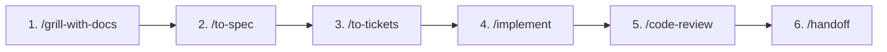

# Руководство для AI-Агентов

Данный файл определяет правила, архитектурные стандарты и сквозной процесс разработки для AI-агентов в проекте.

---

## 🔄 6-этапный цикл разработки (Step-by-Step Flow)

Каждая задача, фича или архитектурное изменение должны проходить строгий 6-этапный жизненный цикл.

### 🚨 ЖЕЛЕЗНЫЕ ПРАВИЛА ОСТАНОВКИ (Hard Stop Gates)
1. **Строгие остановки на каждом шаге**: Агент обязан завершать свой ход в конце каждого этапа (1, 2, 3, 4, 5), демонстрировать результаты и **ОЖИДАТЬ явного текстового подтверждения пользователя** перед переходом к следующему этапу. Запрещено выполнять несколько этапов подряд в одном ответе.
2. **КАТЕГОРИЧЕСКИЙ ЗАПРЕТ НА АВТОМАТИЧЕСКИЙ `/handoff`**:
   - Этап 6 (`/handoff`) — это **закрывающий терминальный этап** (удаление временных файлов `.scratch/`, коммит в Git, перезапись `LATEST.md`).
   - **Агент НИ ПРИ КАКИХ ОБСТОЯТЕЛЬСТВАХ не имеет права автоматически переходить к `/handoff`, коммитить в git или очищать `.scratch/` по собственной инициативе.**
   - Переход к `/handoff` выполняется **СТРОГО И ИСКЛЮЧИТЕЛЬНО** по прямой команде пользователя (*«делай handoff»*, *«фиксируй»*, *«закрывай задачу»*, *«мерджим»*).

---

### Этап 1: `/grill-with-docs` (Глубинное интервью и синхронизация)
* **Цель**: Полностью исключить догадки и неверные предположения до написания кода.
* **Действие**: Агент запускает опрос по дереву решений (раунды вопросов с рекомендациями), исследует проект и фиксирует доменные термины в `.agents/CONTEXT.md`, а ключевые архитектурные решения — в `docs/adr/`.
* **Формат вопросов (ОБЯЗАТЕЛЬНО)**: Все раунды вопросов в рамках `/grill-with-docs`, `/grill-me` и любых других интервью **обязательно** задаются через интерактивный инструмент `ask_question` (модальное окно с выбором вариантов и write-in ответом в Antigravity), чтобы пользователю было удобно выбирать варианты в UI.
* **Обязательная калибровка глубины (T-Shirt Sizing):** В самом первом сообщении агент обязан классифицировать масштаб задачи и объявить количество раундов:
    1. *Категория Minor (Точечная правка / Патч)*: правка 1–2 файлов, добавление поля в модель, простая валидация, кнопка на готовом экране.  
       👉 **Регламент: 1 раунд (2–4 вопроса)** через `ask_question`. Дополнительные раунды не требуются.
    2. *Категория Feature (Новая функциональность / Средняя задача)*: новый экран, новый API-эндпоинт, интеграция по готовому API, новая таблица в БД.  
       👉 **Регламент: Минимум 2 обязательных раунда (6–8 вопросов суммарно)**.
    3. *Категория Epic / Architecture (Крупная подсистема / Архитектурный модуль)*: новые демоны/сервисы, новые сквозные агенты (автоматизация QA и др.), интеграция с железом/протоколами, изменение архитектурного ядра.  
       👉 **Регламент: Минимум 3 обязательных раунда (10–12+ вопросов суммарно)**.
* **Прогрессия когнитивных уровней по раундам (адаптируется под домен задачи: UI, бэкенд, алгоритм, бот):**
    * **Раунд 1 — Контур и Happy Path:** границы скоупа (что входит/не входит в MVP), сущности, ключевые контракты и главный позитивный сценарий успеха.
    * **Раунд 2 — Unhappy Path и Граничные условия:** поведение при ошибках, невалидный ввод данных, граничные состояния, отказы внешних зависимостей, пустые состояния (empty states).
    * **Раунд 3 — Жизненный цикл и Качество (NFR):** нефункциональные требования под нагрузкой и в реальной среде — производительность, безопасность, лимиты памяти/токенов, логирование, совместимость и влияние на соседние модули.
* Требования, выявленные ограничения и ответы каждого раунда последовательно аккумулируются в `.scratch/OPEN_QUESTIONS_{feature}.md`.
* **🛑 Остановка**: Агент демонстрирует итоги интервью и останавливается, запрашивая одобрение перехода к `/to-spec`.
* **СТРОГИЙ ЗАПРЕТ НА ДОСРОЧНЫЙ ШЛЮЗ:** Категорически запрещается объявлять завершение интервью и предлагать перейти к Фазе 2 (`/to-spec`), если для категорий `Feature` или `Epic` не пройдены все обязательные раунды. Модель обязана последовательно провести пользователя через каждый раунд.
* **⛔ Phase Gate 1:** Только после завершения всех нормативных раундов агент фиксирует финальный файл `OPEN_QUESTIONS_{feature}.md`, завершает ход и спрашивает: *"Интервью завершено (N раундов). Переходим к формированию спецификации и ADR (`/to-spec`)?"*.

### Этап 2: `/to-spec` (Формализация спецификации)
* **Цель**: Превратить выводы интервью в структурированную и исчерпывающую техническую спецификацию.
* **Действие**: Создается спецификация в `docs/specs/000X-<feature>-spec.md` с описанием функциональных требований, контрактов данных, граничных случаев и критериев приемки.
* **🛑 Остановка**: Агент показывает спецификацию и останавливается, ожидая утверждения пользователем перед декомпозицией.

### Этап 3: `/to-tickets` (Декомпозиция на атомарные тикеты)
* **Цель**: Разбить спецификацию на независимые, готовые к пошаговой реализации задачи (tracer bullets).
* **Действие**: Создаются карточки тикетов в трекере (`.scratch/<feature>/issues/<NN>-<slug>.md`) с явным указанием зависимостей (`Blocked by`). Для масштабных рефакторингов используется паттерн `expand–contract`.
* **🛑 Остановка**: Агент выводит список тикетов и останавливается, ожидая согласования списка и порядка реализации.

### Этап 4: `/implement` (Реализация через TDD и выбор стратегии оркестрации)
* **Цель**: Чистая и надежная имплементация каждого тикета с контролем качества и чистоты контекста.
* **Выбор стратегии исполнения (ОБЯЗАТЕЛЬНО перед написанием кода)**:
  Перед стартом агент оценивает сложность тикетов, граф зависимостей и прогнозируемый объем токенов (Smart Zone < 100–120k) и явно предлагает пользователю стратегию:
  1. **Стратегия In-Place (В текущем окне)**: для компактных задач (независимо от числа тикетов, если суммарный объем укладывается в комфортное окно контекста). Агент делает их последовательно сам.
  2. **Стратегия Sequential Subagents (Последовательные субагенты)**: для объемных задач с тяжелой логикой/тестами. Главный агент-оркестратор последовательно запускает изолированных субагентов по графу зависимостей (`Blocked by`), принимая отчеты и зеленые тесты. Основное окно остается чистым.
  3. **Стратегия Multi-Session (Раздельные сессии)**: для критически больших эпиков, требующих ручной проверки человеком между тикетами и открытия новых диалогов для изоляции задач.
* **Действие**: Имплементация ведется по принципу Test-Driven Development (`red-green-refactor` через скилл `tdd`), модули проектируются глубокими с компактными интерфейсами (`codebase-design`).
* **🛑 Остановка**: Все тесты зеленые, агент выводит отчет о выполненной реализации и **ОСТАНАВЛИВАЕТСЯ**, запрашивая у пользователя разрешение на запуск `/code-review`.

### Этап 5: `/code-review` (Двухвекторный контроль качества)
* **Цель**: Независимая валидация перед коммитом и мерджем.
* **Действие**: Запускаются два параллельных субагента:
  1. **Standards** — проверка на чистоту кода, отсутствие запахов (Fowler smells baseline) и соблюдение стандартов проекта.
  2. **Spec** — проверка на строгое соответствие исходной спецификации (отсутствие упущенных требований и скоуп-крипа).
* **🛑 Остановка**: Агент выводит отчет ревью, устраняет выявленные замечания и **ОБЯЗАТЕЛЬНО ОСТАНАВЛИВАЕТСЯ**, ожидая, пока пользователь ознакомится с кодом, протестирует функционал и явно скомандует перейти к `/handoff`.

### Этап 6: `/handoff` (Фиксация, очистка и передача контекста — ТОЛЬКО ПО КОМАНДЕ ПОЛЬЗОВАТЕЛЯ)
* **Цель**: Аккуратное закрытие задачи и сохранение чистоты контекста.
* **Условие запуска**: Прямое подтверждение от пользователя на закрытие задачи.
* **Действие**: 
  1. **Очистка `.scratch/`**: Полное удаление временных файлов и тикетов завершенной фичи из `.scratch/<feature>/`.
  2. **Фиксация в репозитории**: Сохранение документа передачи контекста в `docs/handoff/YYYY-MM-DD-<feature>.md` и обновление `docs/handoff/LATEST.md`.
  3. **Git коммит**: Коммит проверенных изменений в рабочую ветку.
  4. **Сводка для пользователя**: Формирование краткой сводки и рекомендаций по скиллам для следующей сессии.

---

## 🛠️ Настройки окружения агентов (Agent Skills)

### Issue Tracker
Временные задачи фичи отслеживаются в локальном Markdown-формате (`.scratch/<feature>/issues/`). По завершении этапа `/handoff` временная папка фичи очищается. Подробнее см. [`docs/agents/issue-tracker.md`](../docs/agents/issue-tracker.md).

### Handoff Context
Каждая сессия/фича фиксирует передачу контекста в каталоге [`docs/handoff/`](../docs/handoff/) (`LATEST.md`).

### Domain Docs & Architecture
- **Единый словарь предметной области**: [`.agents/CONTEXT.md`](./CONTEXT.md).
- **Архитектурные решения**: [`docs/adr/`](../docs/adr/).
- Подробнее см. [`docs/agents/domain.md`](../docs/agents/domain.md).

### Triage Labels
Используются 5 канонических ролей триажа (`needs-triage`, `needs-info`, `ready-for-agent`, `ready-for-human`, `wontfix`). Подробнее см. [`docs/agents/triage-labels.md`](../docs/agents/triage-labels.md).
