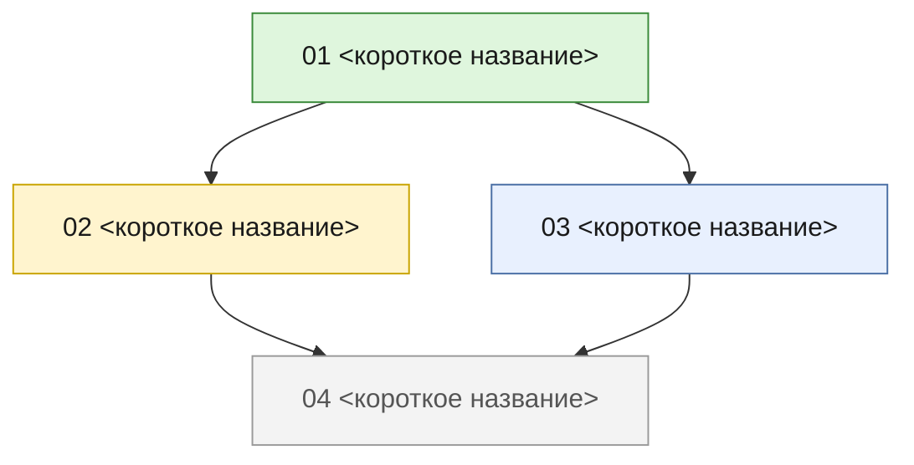

# Tickets map template

The tickets map is the index of a feature's tickets: a mermaid dependency graph coloured by status, a legend, and a table. Copy the block at the end and fill it in:

- **Local tracker** → `.scratch/<feature>/TICKETS.md`, beside `issues/`. Links are relative to that file.
- **External tracker** → a comment on the parent issue (or your message to the user when there is none). Replace file links with issue references.

Write the map's prose, labels and table in the human-facing language set in the root `AGENTS.md`. The block below shows Russian.

## Rules

- **Nodes** — one per ticket: id `T<NN>`, quoted label `"<NN> <short title>"` of at most four words.
- **Edges** — one `T<A> --> T<B>` per blocking edge, read "A blocks B". The edges are exactly the tickets' **Blocked by** lines.
- **Classes** — the four `classDef` lines are fixed. Each ticket gets one class, derived from its **Status** field, the source of truth:

  | Status | Blockers | Class |
  |---|---|---|
  | `done` | — | `done` |
  | `in-progress` | — | `inprogress` |
  | `ready-for-agent` | all `done` | `ready` (the frontier) |
  | `ready-for-agent` | any not `done` | `blocked` |

  Group tickets per class on one `class` line; omit a class line that has no tickets.
- **Table** — one row per ticket in number order; the Status column copies the field verbatim.
- **Sync** — whoever changes a ticket's Status updates, in the same edit, its class, its table row, and the class of every ticket that change unblocks (`blocked` → `ready`).

## Block

````markdown
# <feature> — карта тикетов

Спека: [`docs/specs/<NNNN>-<feature>-spec.md`](../../docs/specs/<NNNN>-<feature>-spec.md). Тикеты: [`issues/`](./issues/).

Стрелка `A --> B` означает «A блокирует B». Цвет узла показывает статус тикета. Источник истины по статусу — поле **Status** в файле тикета.



**Легенда:** синий — `ready-for-agent`, все блокеры закрыты (фронтир) · жёлтый — `in-progress` · зелёный — `done` · серый — ждёт блокеров.

| # | Тикет | Blocked by | Status |
|---|---|---|---|
| 01 | [<название тикета>](./issues/01-<slug>.md) | — | done |
| 02 | [<название тикета>](./issues/02-<slug>.md) | 01 | in-progress |
| 03 | [<название тикета>](./issues/03-<slug>.md) | 01 | ready-for-agent |
| 04 | [<название тикета>](./issues/04-<slug>.md) | 02, 03 | ready-for-agent |
````
