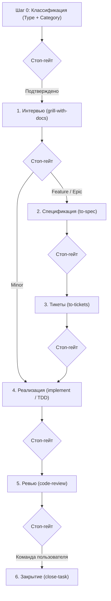

# Шаблон проекта с AI-ассистентами (NEW-PROJECT-SETUP)

Репозиторий-шаблон (Template Repository) для организации профессиональной разработки с AI-ассистентами. Содержит проверенный цикл разработки, строгие правила взаимодействия, механизмы контроля контекста и богатый набор специализированных скиллов (skills).

Поддерживает совместную работу в нескольких AI-окружениях:
- **Google Antigravity** (нативная поддержка правил и скиллов)
- **Claude Code** (автоматическое зеркалирование скиллов в `.claude/skills/`, правила через `CLAUDE.md`)
- **OpenAI Codex / Codex CLI** (правила через компактный `AGENTS.md`)
- **Cursor** (правила через `AGENTS.md`)

---

## Требования

### Для работы с Проектом
- **git** (версия ≥ 2.30)
- **PowerShell 7+** (`pwsh`) — используется для запуска автоматизации, скриптов инициализации, обновления и валидации.

### Только для разработки Шаблона
- **Pester 5+** — фреймворк тестирования PowerShell (`Install-Module Pester -MinimumVersion 5.0.0`). Необходим только разработчикам шаблона для прогона тестов в `/tests/`. Конечным проектам не требуется.

---

## Создание нового Проекта

1. **Создайте репозиторий из шаблона:**
   - Нажмите **«Use this template»** в интерфейсе GitHub или клонируйте репозиторий:
     ```powershell
     git clone <url-шаблона> my-project
     cd my-project
     ```
2. **Инициализируйте проект:**
   - В чате с агентом введите команду: `/init-project`
   - Либо запустите скрипт напрямую в PowerShell:
     ```powershell
     pwsh -NoProfile -File .agents/skills/init-project/scripts/Initialize-Project.ps1 -Mode New -Tracker local
     ```

Что произойдёт в режиме `New`:
- Удалятся Метадокументы разработки самого Шаблона (`tests/`, `docs/dry-run-checklist.md`, спеки и ADR шаблона).
- Документы заменятся чистыми скелетами для нового проекта (`README.md`, `.agents/CONTEXT.md`, `CODING_STANDARDS.md`, `docs/handoff/LATEST.md`).
- В заголовке Реестра скиллов зафиксируются версия и источник шаблона.
- Настроится локальный трекер задач (`.scratch/<feature>/issues/`).

---

## Режимы работы `Initialize-Project.ps1`

Скрипт [.agents/skills/init-project/scripts/Initialize-Project.ps1](.agents/skills/init-project/scripts/Initialize-Project.ps1) поддерживает 4 режима:

| Режим | Назначение | Пример команды |
|---|---|---|
| **New** | Создание чистого проекта из шаблона (удаление мета-файлов, разворачивание каркасов). | `pwsh -NoProfile -File .agents/skills/init-project/scripts/Initialize-Project.ps1 -Mode New -Tracker local` |
| **Adopt** | Подключение правил и скиллов к существующему коду без перезаписи файлов пользователя. Выводит отчёт о конфликтах и обновляет `.gitignore`. | `pwsh -NoProfile -File <путь-к-шаблону>/.agents/skills/init-project/scripts/Initialize-Project.ps1 -Mode Adopt -RepoRoot . -Tracker local` |
| **Update** | Обновление правил и скиллов в проекте из свежей версии Шаблона. Без `-Apply` показывает diff (dry-run); с `-Apply` применяет изменения. | `pwsh -NoProfile -File <путь-к-шаблону>/.agents/skills/init-project/scripts/Initialize-Project.ps1 -Mode Update -RepoRoot . -Apply` |
| **SetTracker** | Смена используемого трекера задач (`local`, `github` или `gitlab`). | `pwsh -NoProfile -File .agents/skills/init-project/scripts/Initialize-Project.ps1 -Tracker github` |

Все режимы идемпотентны и безопасны для повторного запуска.

---

## Процесс разработки (Workflow Summary)

Поведение агента определяется правилами в [AGENTS.md](AGENTS.md) (для Claude Code зеркалируется через [CLAUDE.md](CLAUDE.md)).



### 1. Шаг 0 — Классификация до начала работы
В первом сообщении агент объявляет **Тип** и **Категорию** с однострочным обоснованием и ждёт подтверждения пользователя:
- **Тип:**
  - `Development` — меняет код, конфигурацию или тесты.
  - `Analysis` — результатом является документ исследования в `docs/analysis/`, код не меняется.
- **Категория (для Development):**
  - `Minor` — 1–2 файла, один модуль, нет новых сущностей и интеграций.
  - `Feature` — одна подсистема, новый экран/эндпоинт/таблица, интеграция с известным API.
  - `Epic` — несколько модулей, смена базовой архитектуры/контрактов, много неизвестных.
  - `Туман (Fog)` — путь к результату не виден; направляется в `wayfinder` для снятия неопределённости.

### 2. Маршруты и квоты интервью
- **Minor:** 1 раунд интервью (2–4 вопроса) → реализация In-Place → ревью → закрытие.
- **Feature:** ≥ 2 раунда интервью (6–8 вопросов) → спецификация в `docs/specs/` → тикеты в `.scratch/<feature>/issues/` с графом зависимостей `TICKETS.md` → реализация → ревью → закрытие.
- **Epic:** ≥ 3 раунда интервью (10–12+ вопросов) → спецификация → тикеты → реализация через **Оркестратор** (отдельные субагенты по очереди с изолированным брифом) → ревью → закрытие.
- **Анализ:** 1 раунд (4 вопроса) → сбор данных → черновик в `docs/analysis/` → согласование → закрытие.

### 3. Стоп-гейты (Stop Gates)
- **Один этап за один ответ:** агент никогда не перескакивает через этапы и ждёт подтверждения перед переходом к следующему шагу.
- **Жёсткий guardrail:** агент ни при каких условиях не коммитит, не очищает `.scratch/` и не завершает задачу без явной текстовой команды пользователя («закрывай задачу», «фиксируй», «делай handoff»).

### 4. Handoff vs Close-task
- **Handoff ([/handoff](.agents/skills/handoff/SKILL.md)):** перенос контекста в новую сессию или фиксация промежуточного состояния. Создаёт документ `docs/handoff/YYYY-MM-DD-<тема>.md`, обновляет `docs/handoff/LATEST.md`, очищает завершённые тикеты. **Не коммитит.**
- **Close-task ([/close-task](.agents/skills/close-task/SKILL.md)):** полное закрытие задачи после ревью по команде пользователя. Выполняет предварительные проверки тестов, формирует handoff, полностью очищает `.scratch/<feature>/`, делает локальный коммит. **Не делает `git push`** (публикация всегда остаётся за человеком).

### 5. Бюджет контекста (Smart zone)
- Рабочая зона глубокого контекста составляет **≈120k токенов**.
- Перед началом написания кода в `/implement` агент оценивает объём задачи по графу тикетов и выбирает стратегию: **In-Place** (в текущем контексте), **Sequential Subagents** (последовательные субагенты с брифом) или **Multi-Session** (разбиение на этапы с handoff между ними).

---

## Навигация и инструменты

- **Маршрутизатор скиллов:** [`/ask`](.agents/skills/ask/SKILL.md) — интерактивный помощник по выбору подходящего скилла под задачу.
- **Реестр скиллов:** [`.agents/SKILLS.md`](.agents/SKILLS.md) — полный список всех зарегистрированных скиллов с метаданными.
- **Глоссарий понятий:** [`.agents/CONTEXT.md`](.agents/CONTEXT.md) — единые термины процесса и проекта.
- **Архитектурные решения (ADR):** [`docs/adr/`](docs/adr/) — журнал принятых архитектурных решений.
- **Трекер задач:** [`docs/agents/issue-tracker.md`](docs/agents/issue-tracker.md) — формат локального трекера задач.
- **Зеркалирование для Claude Code:** [`.agents/scripts/Sync-ClaudeSkills.ps1`](.agents/scripts/Sync-ClaudeSkills.ps1).
- **Валидатор целостности Шаблона:** [`.agents/scripts/Test-Template.ps1`](.agents/scripts/Test-Template.ps1).
- **Чек-лист пробного прогона (Seam D):** [`docs/dry-run-checklist.md`](docs/dry-run-checklist.md).
