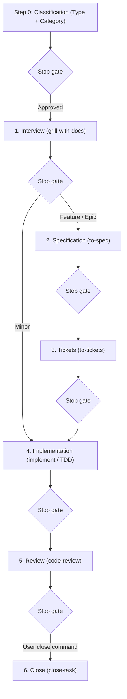

# StrataHarness

[English](README.md) | [Русский](README.ru.md)

A production-ready Template repository for software development with autonomous AI coding agents. It provides a structured 6-stage development lifecycle, explicit stop gates, context management protocols, and a comprehensive library of specialized agent skills.

Supported AI agent environments:
- **Google Antigravity** (native support for rules and skills)
- **Claude Code** (automated skills mirroring into `.claude/skills/`, rules via `CLAUDE.md`)
- **OpenAI Codex / Codex CLI** (rules via compact `AGENTS.md`)
- **Cursor** (rules via `AGENTS.md`)

---

## Requirements

### For Projects using this Template
- **git** (version ≥ 2.30)
- **PowerShell 7+** (`pwsh`) — used for automation scripts, initialization, updates, and integrity checks across Windows, macOS, and Linux.

### For Template Development only
- **Pester 5+** — PowerShell testing framework (`Install-Module Pester -MinimumVersion 5.0.0`). Only needed by template maintainers to execute tests in `tests/`. Not needed by downstream projects.

---

## Creating a New Project

1. **Create a repository from the template:**
   - Click **"Use this template"** on GitHub, or clone the repository using a specific release tag:
     ```powershell
     git clone --branch v1.0.0 https://github.com/cannoneer85-svg/StrataHarness.git my-project
     cd my-project
     ```
2. **Initialize the project:**
   - **Via AI Agent (recommended):** In your agent session, type `/init-project` (or say *"Initialize new project"*). The agent runs the deterministic script and guides you through configuring the issue tracker, tech stack ([`.agents/CONTEXT.md`](.agents/CONTEXT.md)), and coding conventions (`CODING_STANDARDS.md`).
   - **Or directly via terminal:**
     ```powershell
     pwsh -NoProfile -File .agents/skills/init-project/scripts/Initialize-Project.ps1 -Mode New -Tracker local
     ```

### What happens in `New` mode
- Removes Template development metadata and release files (`tests/`, `docs/dry-run-checklist.md`, template specs and ADRs, `LICENSE`, `CHANGELOG.md`, `VERSION`, `.github/`, `README.ru.md`, `CONTRIBUTING.md`, `SECURITY.md`, `docs/releasing.md`, and the `release` skill).
- Preserves [`THIRD_PARTY_NOTICES.md`](THIRD_PARTY_NOTICES.md).
- Sets up clean starter skeletons for your project (`README.md`, [`.agents/CONTEXT.md`](.agents/CONTEXT.md), `CODING_STANDARDS.md`, [`docs/handoff/LATEST.md`](docs/handoff/LATEST.md)).
- Records the template version (`vX.Y.Z (<sha>)`) and source in the Skill Registry header.
- Configures the task tracker (e.g. local tracker in `.scratch/<feature>/issues/`).

---

## `Initialize-Project.ps1` Modes

The lifecycle automation engine ([`.agents/skills/init-project/scripts/Initialize-Project.ps1`](.agents/skills/init-project/scripts/Initialize-Project.ps1)) supports 4 modes, accessible either interactively through the AI agent or directly via PowerShell:

| Mode | Purpose | AI Agent Invocation | Direct CLI Command |
|---|---|---|---|
| **New** | Create a clean project from the template (strips meta files, installs skeletons). | `/init-project` or *"Initialize new project"* | `pwsh -NoProfile -File .agents/skills/init-project/scripts/Initialize-Project.ps1 -Mode New -Tracker local` |
| **Adopt** | Adopt skills and rules into an existing codebase without overwriting user files. Reports conflicts and updates `.gitignore`. | `/init-project adopt` or *"Adopt StrataHarness into existing project"* | `pwsh -NoProfile -File <template-path>/.agents/skills/init-project/scripts/Initialize-Project.ps1 -Mode Adopt -RepoRoot . -Tracker local` |
| **Update** | Update rules and skills in an existing project from a newer template version. Without `-Apply`, shows diff and changelog (dry-run); with `-Apply`, applies changes. | `/init-project update` or *"Update template skills"* | `pwsh -NoProfile -File <template-path>/.agents/skills/init-project/scripts/Initialize-Project.ps1 -Mode Update -RepoRoot . -Apply` |
| **SetTracker** | Switch task tracker provider (`local`, `github`, or `gitlab`). | `/init-project tracker` or *"Switch tracker to github"* | `pwsh -NoProfile -File .agents/skills/init-project/scripts/Initialize-Project.ps1 -Tracker github` |

All modes are idempotent and safe to re-run.

### Issue Tracker Providers

StrataHarness provides 3 issue tracker adapters configured via `-Tracker <provider>`:

| Provider | Where issues live | Requirements | Best for |
|---|---|---|---|
| **`local`** *(default)* | Local Markdown files under `.scratch/<feature>/issues/` with dependency map `TICKETS.md`. | None. Works completely offline. | Solo development, private repos, or self-contained AI sessions without external services. |
| **`github`** | GitHub Issues within the repository. | GitHub CLI (`gh`) installed and authenticated (`gh auth login`). | Open-source or team projects hosted on GitHub; links tickets with PRs and milestones. |
| **`gitlab`** | GitLab Issues within the project. | GitLab CLI (`glab`) installed and authenticated (`glab auth login`). | Projects hosted on GitLab / GitLab Self-Managed; links issues with Merge Requests. |

You can switch providers at any time with `Initialize-Project.ps1 -Tracker <provider>` (or by asking the agent *"Switch tracker to github"*). Only [`docs/agents/issue-tracker.md`](docs/agents/issue-tracker.md) and [`AGENTS.md`](AGENTS.md) are modified; no application code is touched.

---

## Development Lifecycle (Workflow Summary)

Agent behavior is governed by strict rules in [`AGENTS.md`](AGENTS.md) (mirrored for Claude Code in [`CLAUDE.md`](CLAUDE.md)).



### 1. Step 0 — Classification Before Any Work
In the initial response, the agent announces the **Type** and **Category** with a one-line justification and waits for user confirmation:
- **Type:**
  - `Development` — changes code, configuration, or tests.
  - `Analysis` — outputs research in `docs/analysis/`, leaving code untouched.
- **Category (for Development):**
  - `Minor` — 1–2 files, single module, no new entities or integrations.
  - `Feature` — one subsystem, new screen/endpoint/entity, known API integration.
  - `Epic` — multiple modules, core architecture changes, many unknowns.
  - `Fog (Туман)` — path is unclear; routed to `wayfinder` to resolve ambiguity.

### 2. Routes and Interview Quotas
- **Minor:** 1 interview round (2–4 questions) → In-Place implementation → review → close.
- **Feature:** ≥ 2 interview rounds (6–8 questions) → specification in `docs/specs/` → tickets in `.scratch/<feature>/issues/` with dependency graph `TICKETS.md` → implementation → review → close.
- **Epic:** ≥ 3 interview rounds (10–12+ questions) → specification → tickets → Orchestrator implementation (isolated subagents per ticket) → review → close.
- **Analysis:** 1 short round (4 questions) → research → draft in `docs/analysis/` → review → close.

### 3. Stop Gates
- **One stage per turn:** The agent never skips stages and stops to present results at each stop gate, waiting for explicit user approval before proceeding.
- **Hard Guardrail:** The agent never commits, cleans `.scratch/`, or closes a task without an explicit user command (e.g. «закрывай задачу», «фиксируй», «делай handoff»). The `/release` command is the sole command permitted to push, and ONLY after explicit confirmation at the release stop gate; force-push is strictly prohibited under all circumstances. Other skills (including `/close-task`) never perform `git push`.

### 4. Handoff vs Close-task
- **Handoff ([`/handoff`](.agents/skills/handoff/SKILL.md)):** Preserves session context into `docs/handoff/YYYY-MM-DD-<topic>.md`, updates `docs/handoff/LATEST.md`, and cleans completed tickets. **Never commits.**
- **Close-task ([`/close-task`](.agents/skills/close-task/SKILL.md)):** Fully closes a task following successful review upon user command. Runs pre-flight checks, generates handoff, clears `.scratch/<feature>/`, and creates a local commit. **Never pushes.**

### 5. Context Budget (Smart Zone)
- Working context is kept within the **Smart zone** (≈120k tokens).
- Prior to coding, the agent chooses an execution strategy: **In-Place** (within current session), **Sequential Subagents** (fresh subagents per ticket), or **Multi-Session** (session handoffs across iterations).

---

## Template Versioning & Updating

The template uses [Semantic Versioning (SemVer)](https://semver.org/):
- Version source of truth is the [`VERSION`](VERSION) file (`X.Y.Z`) and annotated git tags (`vX.Y.Z`).
- Changelog is maintained in [`CHANGELOG.md`](CHANGELOG.md).

### Updating a Downstream Project
To update an existing project with improvements, bug fixes, or new skills from this Template:

1. **Via AI Agent (interactive):**
   Simply ask your agent *"Update template skills"* (or type `/init-project update`). The agent checks your recorded `template-version`, inspects the upstream template, presents the CHANGELOG diff and any breaking changes, and asks for confirmation before applying.

2. **Via PowerShell directly:**
   - Fetch or clone the target template release tag:
     ```powershell
     git clone --branch v1.1.0 https://github.com/cannoneer85-svg/StrataHarness.git ../template-release
     ```
   - Preview the changes (dry-run):
     ```powershell
     pwsh -NoProfile -File ../template-release/.agents/skills/init-project/scripts/Initialize-Project.ps1 -Mode Update -RepoRoot .
     ```
     The script inspects your recorded `template-version`, displays the target version, prints the relevant CHANGELOG excerpt for the versions in-between, and flags any MAJOR breaking changes.
   - Apply the update:
     ```powershell
     pwsh -NoProfile -File ../template-release/.agents/skills/init-project/scripts/Initialize-Project.ps1 -Mode Update -RepoRoot . -Apply
     ```

---

## Navigation & Documentation

- **Skill Router:** [`/ask`](.agents/skills/ask/SKILL.md) — interactive skill finder.
- **Skill Registry:** [`.agents/SKILLS.md`](.agents/SKILLS.md) — complete catalog of registered skills and metadata.
- **Glossary:** [`.agents/CONTEXT.md`](.agents/CONTEXT.md) — unified terms and domain concepts.
- **Architectural Decision Records (ADRs):** [`docs/adr/`](docs/adr/) — architecture decisions log.
- **Release Automation:** [`docs/releasing.md`](docs/releasing.md) — release workflow, bump rules, and GitHub setup.
- **Contributing Guide:** [`CONTRIBUTING.md`](CONTRIBUTING.md) — contribution guidelines, Conventional Commits, and PR checklist.
- **Security Policy:** [`SECURITY.md`](SECURITY.md) — vulnerability reporting and supported versions.
- **License:** [`LICENSE`](LICENSE) — MIT License.
- **Third-Party Notices:** [`THIRD_PARTY_NOTICES.md`](THIRD_PARTY_NOTICES.md) — credits and licenses for adapted skills.
- **Russian Documentation:** [`README.ru.md`](README.ru.md) — full Russian version of this guide.
