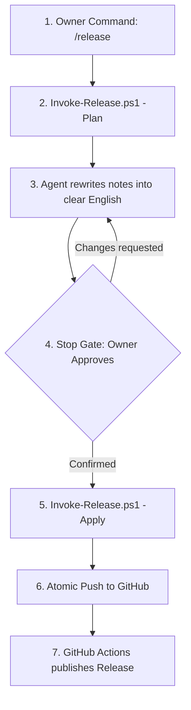

# Template Release Process & GitHub Setup

This document describes the release workflow for the AI Agent Template, SemVer bump rules, error recovery procedures, and repository configuration checklists.

---

## Semantic Versioning & Bump Rules

The Template adheres to [Semantic Versioning (SemVer 2.0)](https://semver.org/). The version is stored in the [`VERSION`](../VERSION) file (`X.Y.Z`) and annotated git tags (`vX.Y.Z`).

Because this is a project template (not a software library or application), the SemVer bump semantics are defined around **backward compatibility for downstream Projects** (see [ADR 0004](adr/0004-semver-template-version.md)):

| Level | When to Bump | Determination & Signals |
|---|---|---|
| **MAJOR** | Breaking changes that break `-Mode Update` for existing projects: removing or renaming a skill folder; modifying [`Initialize-Project.ps1`](../.agents/skills/init-project/scripts/Initialize-Project.ps1) parameters; changing the Skill Registry format in [`.agents/SKILLS.md`](../.agents/SKILLS.md); changing routes, stop gates, or hard guardrails in [`AGENTS.md`](../AGENTS.md). | Commits with `!` (e.g. `feat!:`) or `BREAKING CHANGE:` footer. The release script also flags deleted or renamed folders under `.agents/skills/` as candidate MAJOR bumps. Final determination is confirmed at the stop gate. |
| **MINOR** | Adding new functionality: a new agent skill, new capability, or backward-compatible enhancement to existing skills and scripts. | Commits with `feat` type. |
| **PATCH** | Backward-compatible bug fixes, documentation updates, refactoring, performance improvements, test updates, or tooling/CI improvements. | Commits with `fix`, `docs`, `chore`, `refactor`, `test`, `ci`, `perf`, `style`, `build` types. |

The owner can override the bump level at planning time using `-Bump <major|minor|patch>` or set an explicit version using `-Version <X.Y.Z>`.

---

## The `/release` Workflow

Releases are created locally via the release automation script ([`.agents/skills/release/scripts/Invoke-Release.ps1`](../.agents/skills/release/scripts/Invoke-Release.ps1)) driven by the [`/release`](../.agents/skills/release/SKILL.md) skill (see [ADR 0005](adr/0005-release-skill-pushes-after-confirmation.md)).



### Step 1: Plan
Run the script in plan mode:
```powershell
pwsh -NoProfile -File .agents/skills/release/scripts/Invoke-Release.ps1 -Plan
```
The script verifies preconditions:
- **P1:** Working tree is clean (no uncommitted changes).
- **P2:** Current branch is `main`.
- **P3:** Integrity checks (`Test-Template.ps1`) and Pester tests pass.
- **P4:** New commits exist since the previous tag.
- **P5:** Target version tag does not already exist.

Outputs generated under `.scratch/release/`:
- `plan.json`: Machine-readable classification, proposed version, and warnings.
- `notes.draft.md`: Draft release notes grouped by section (`Breaking`, `Added`, `Changed`, `Fixed`, `Removed`, `Other`).

### Step 2: Release Notes Review & Polish
The agent reads `notes.draft.md` and `plan.json`, rewrites commit messages into polished English release notes without dropping changes, documents any non-conventional commits in `Other`, and proposes a release title.

### Step 3: Stop Gate
The agent presents the complete proposal to the owner:
- Target version and tag (e.g. `1.1.0` / `v1.1.0`).
- Proposed release title (e.g. `Atomic release workflow and GitHub CI`).
- Formatted release notes.
- Warnings (such as MAJOR candidate flags or non-conventional commits).

The agent pauses at the stop gate. **No files are committed, tagged, or pushed without explicit confirmation.**

### Step 4: Apply & Push
Upon explicit owner approval («выпускай релиз», «ок», «release»), the agent runs:
```powershell
pwsh -NoProfile -File .agents/skills/release/scripts/Invoke-Release.ps1 -Apply -NotesFile .scratch/release/notes.draft.md -Title "<Title>"
```
The script:
1. Re-verifies preconditions and ensures HEAD matches the planned commit.
2. Checks that local `main` is not behind `origin/main` (P6).
3. Updates [`VERSION`](../VERSION), prepends the new release section to [`CHANGELOG.md`](../CHANGELOG.md), and updates `template-version` in [`.agents/SKILLS.md`](../.agents/SKILLS.md).
4. Commits `chore(release): vX.Y.Z`.
5. Creates an annotated tag `vX.Y.Z` containing the release title.
6. Pushes `main` and `vX.Y.Z` atomically to `origin` (`git push --atomic origin main vX.Y.Z`).

### Step 5: Verification
On GitHub, the push triggers [`.github/workflows/release.yml`](../.github/workflows/release.yml), which:
1. Runs `Invoke-Release.ps1 -Notes $tag` to extract notes and title.
2. Creates the official GitHub Release with release notes matching `CHANGELOG.md`.

---

## Error Recovery Procedures

### 1. Push Failure (`-PushOnly`)
If network or authentication issues cause `git push --atomic` to fail:
- The local release commit and tag remain completely intact.
- Once the connectivity or credential issue is resolved, re-attempt only the push:
  ```powershell
  pwsh -NoProfile -File .agents/skills/release/scripts/Invoke-Release.ps1 -Apply -PushOnly
  ```

### 2. Aborting an Unpushed Release (`-Undo`)
If a release was created locally with `-Apply` but has **not** been pushed to `origin`, and you need to abort:
```powershell
pwsh -NoProfile -File .agents/skills/release/scripts/Invoke-Release.ps1 -Undo
```
The script:
- Verifies that HEAD is indeed the release commit.
- Checks via `git ls-remote` that the tag has **not** been published to remote `origin`.
- Deletes the local tag and rolls back HEAD by one commit (`git reset --mixed HEAD~1`), returning the working tree to the pre-release state.
- **Safety guarantee:** `-Undo` strictly refuses to run if the tag already exists on `origin`.

### 3. Fixing an Already-Published Release
- Git history on `main` is immutable: force-push (`git push --force` or `--force-with-lease`) is **strictly forbidden**.
- If a published release contains an error, fix the issue with standard commits and publish a new **PATCH** release.

---

## GitHub Setup Checklist

Follow this checklist when creating and configuring the GitHub repository (`cannoneer85-svg/StrataHarness`):

### 1. Repository Configuration
- [ ] **Template repository:** In `Settings > General`, check **Template repository**.
- [ ] **Pull Requests & Merge Policy:**
  - Check **Allow squash merging**.
  - Uncheck **Allow merge commits**.
  - Uncheck **Allow rebase merging**.
  - Set **Default commit message** to **Pull request title** (or *Pull request title and commit details*).
  - Check **Automatically delete head branches**.

### 2. Branch Protection & Rulesets (`main`)
Configure a ruleset for branch `main` (`Settings > Rules > Rulesets`):
- [ ] **Ruleset Name:** `main-branch-protection`
- [ ] **Enforcement status:** Active
- [ ] **Target branches:** Include `main`
- [ ] **Bypass list:** Add repository Administrator / Owner (`cannoneer85-svg`) with **Always allow bypass**.
  > [!IMPORTANT]
  > **The owner bypass is mandatory.** The `/release` workflow commits and pushes release tags directly to `main`. Without the owner bypass, direct push of release commits would be blocked by branch protection.
- [ ] **Branch rules:**
  - Check **Require a pull request before merging** (for regular contributors).
  - Check **Require status checks to pass before merging** (select these checks after the first CI run completes):
    - Require status check: `Test (windows-latest)`
    - Require status check: `Test (ubuntu-latest)`
    - Require status check: `Check PR Title`
  - Check **Block force pushes**.
  - Check **Restrict deletions**.

### 3. Code Security & Analysis
In `Settings > Code security and analysis`:
- [ ] **Dependabot alerts:** Enabled.
- [ ] **Dependabot security updates:** Enabled.
- [ ] **Private vulnerability reporting:** Enabled (used by [`SECURITY.md`](../SECURITY.md)).

---

## Transitioning from Private to Public Checklist

When ready to open-source the repository:

- [ ] **Audit Git History:** Verify that no private credentials, SSH keys, passwords, personal tokens, or proprietary files exist anywhere in the git history.
- [ ] **Audit Disk Paths:** Verify that no local filesystem paths (e.g. `YandexDisk` or internal user profile folders) are present in tracked files or commit messages.
- [ ] **Validate Public Documentation:**
  - [`README.md`](../README.md) (English root README)
  - [`README.ru.md`](../README.ru.md) (Russian translation)
  - [`CONTRIBUTING.md`](../CONTRIBUTING.md) (Contribution guidelines)
  - [`SECURITY.md`](../SECURITY.md) (Security policy & advisory link)
  - [`LICENSE`](../LICENSE) (MIT License, Sergey Bizikin)
  - [`THIRD_PARTY_NOTICES.md`](../THIRD_PARTY_NOTICES.md) (Matt Pocock credits & licenses)
  - [`docs/releasing.md`](releasing.md) (Release guide)
- [ ] **Run Test Validation:**
  ```powershell
  pwsh -NoProfile -File .agents/scripts/Test-Template.ps1
  pwsh -NoProfile -Command "Invoke-Pester -Path tests -Output Detailed"
  ```
- [ ] **Publish Initial Release:** Release `v1.0.0` via `/release`.
- [ ] **Change Repository Visibility:** In `Settings > General > Danger Zone > Change repository visibility`, change from **Private** to **Public**.
