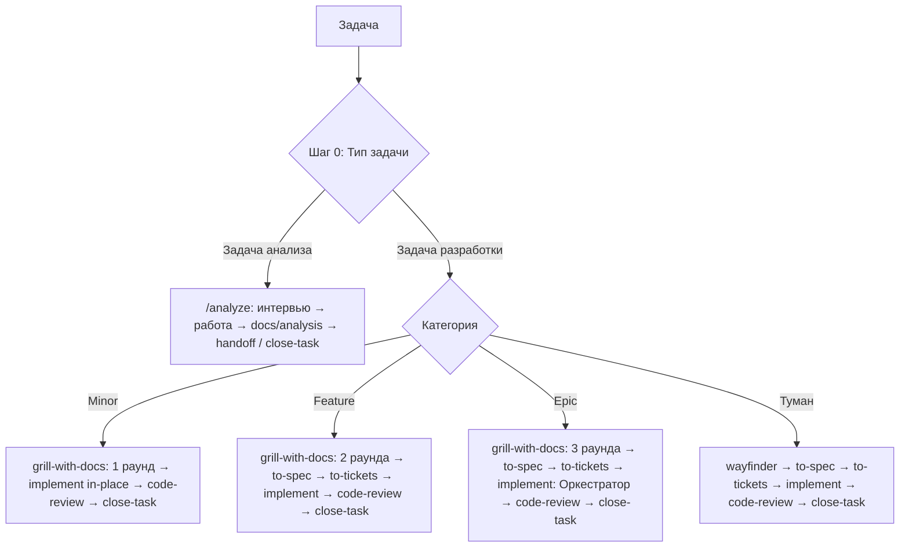

# 0001 — Шаблон v2: маршрутизация, четыре harness, Оркестратор, жизненный цикл Проекта

- **Статус:** approved (2026-10-03)
- **Дата:** 2026-10-03
- **Категория:** Epic / Architecture
- **Источники:** интервью `.scratch/template-v2/OPEN_QUESTIONS.md` (22 решения), аудит сессии 2026-10-03, ADR [0001](../adr/0001-repo-root-is-the-template.md), [0002](../adr/0002-flat-skills-with-claude-mirror.md), [0003](../adr/0003-edit-upstream-skills-in-place.md)
- **Словарь:** термины с заглавной буквы определены в [`.agents/CONTEXT.md`](../../.agents/CONTEXT.md)

> [!NOTE]
> В этой спеке, вопреки обычному правилу `/to-spec`, указаны пути к файлам: в Шаблоне файлы и их расположение и есть контракты.

---

## Problem Statement

Я создаю новые проекты из этого Шаблона и хочу, чтобы агенты в них работали по предсказуемому, проверяемому процессу. Сейчас:

1. **Процесс нельзя выполнить до конца.** Репозиторий не был под git, поэтому `/code-review` (сравнивает через `git diff`) и коммит в `/handoff` не работали.
2. **Агент получает противоречивые инструкции.** `.agents/AGENTS.md` переопределяет поведение скиллов Matt Pocock, но сами скиллы остались прежними:
   - `/handoff` описан по-разному: закрытие задачи с коммитом против переноса контекста;
   - коммит в `/implement` то разрешён, то запрещён;
   - в `/to-spec` нет пути к спекам;
   - лимит контекста указан тремя разными числами.
3. **Нет маршрута по типу и размеру задачи.** Мелкая правка проходит 6 этапов, как Epic. Для задач анализа (не код) процесса нет вообще.
4. **Шаблон работает только в Antigravity.** Codex, Cursor и Claude Code не читают `.agents/AGENTS.md`, а Claude Code не видит `.agents/skills/`.
5. **Оркестрация не описана.** `/implement` говорит «dispatch subagents», но не задаёт ни бриф, ни отчёт, ни проверку. Агент легко делает всё сам в одном окне.
6. **У Шаблона нет жизненного цикла.** Неясно, как создать Проект, как добавить сетап в существующий репозиторий, как обновить Проект до новой версии и как не утащить в Проект Метадокументы Шаблона.
7. **Нет списка скиллов.** 35 скиллов разного назначения (код, аналитика, письмо) без каталога. Неясно, что активно и откуда взялось.

## Solution

Шаблон v2 даёт один короткий всегда загружаемый `AGENTS.md`, который маршрутизирует любую задачу, и скиллы, в которых живут процедуры.

- **Стоп-гейт** в конце каждого этапа. `/close-task` (коммит) запускается только по команде пользователя.
- **Работает в четырёх harness:**
  - корневой `AGENTS.md` (Claude Code читает его через `CLAUDE.md` = `@AGENTS.md`);
  - плоские `.agents/skills/` плюс генерируемое зеркало `.claude/skills/`;
  - флаги ручного запуска для Claude и Cursor, а для Codex дублирующий `agents/openai.yaml`.
- **Реестр скиллов** `.agents/SKILLS.md` — каталог по категориям с источником и режимом запуска.
- **`/init-project`** в трёх режимах (Новый / Добавить / Обновить) поверх PowerShell-скриптов. Скрипт проверки поддерживает Шаблон в целостном состоянии.

---

## User Stories

### Маршрутизация

1. Как пользователь, я хочу, чтобы агент до начала работы объявил Тип задачи и Категорию с обоснованием, чтобы я мог подтвердить или поправить маршрут одним словом.
2. Как пользователь, я хочу, чтобы Категория определялась по явным признакам (число затронутых модулей, новые сущности и контракты, внешние интеграции, число неизвестных, умещается ли в сессию), чтобы оценка была воспроизводимой.
3. Как пользователь, я хочу, чтобы Категорию можно было поднять или понизить по ходу интервью, чтобы ошибка первичной оценки не стоила лишних раундов или пропущенных вопросов.
4. Как пользователь, я хочу, чтобы задачу без видимого пути агент направлял в `/wayfinder`, а не в интервью, чтобы не тратить раунды на то, что нельзя решить в одной сессии.
5. Как пользователь, я хочу, чтобы Minor-задача шла коротким маршрутом без спеки и тикетов, чтобы мелкая правка не требовала шести этапов.
6. Как пользователь, я хочу, чтобы задачи анализа шли отдельным облегчённым флоу без TDD и code-review, чтобы использовать Шаблон не только для кода.
7. Как пользователь, я хочу вызвать `/ask` и получить подсказку, какой скилл или флоу подходит моей ситуации, чтобы не держать в голове весь каталог.

### Интервью и спецификация

8. Как пользователь, я хочу, чтобы число раундов интервью (1 / 2 / 3) задавалось Категорией и было записано в AGENTS.md, чтобы правило всегда было в контексте.
9. Как пользователь, я хочу, чтобы содержание раундов (контур → ошибки и граничные случаи → NFR) было описано в `/grill-with-docs`, чтобы процедура жила в одном месте.
10. Как пользователь, я хочу отвечать на вопросы интервью через интерактивный инструмент harness (в Antigravity — `ask_question`), если он есть, чтобы выбирать варианты в UI.
11. Как пользователь, я хочу, чтобы ответы копились в `.scratch/<feature>/OPEN_QUESTIONS.md`, чтобы ход интервью не терялся.
12. Как пользователь, я хочу, чтобы агент не предлагал переход к спеке, пока не пройдены все обязательные раунды, чтобы интервью не обрывалось досрочно.
13. Как пользователь, я хочу, чтобы `/to-spec` писал спеку в `docs/specs/NNNN-<feature>-spec.md` и оформлял ADR по критериям из `domain-modeling`, чтобы решения были зафиксированы в репозитории.
14. Как пользователь, я хочу, чтобы `/to-tickets` создавал тикеты в `.scratch/<feature>/issues/` со статусами `ready-for-agent → in-progress → done`, чтобы видеть прогресс.

### Реализация и Оркестратор

15. Как пользователь, я хочу, чтобы `/implement` до написания кода предлагал стратегию (In-Place / Sequential Subagents / Multi-Session) с обоснованием по объёму и графу тикетов, чтобы выбор был осознанным.
16. Как пользователь, я хочу, чтобы при стратегии Sequential Subagents Оркестратор никогда не писал код сам, а на каждый тикет запускал отдельного субагента, чтобы основное окно оставалось чистым.
17. Как Оркестратор, я хочу собирать Бриф по шаблону (тикет, спека, глоссарий, затронутые ADR, согласованные seams, definition of done, формат отчёта), чтобы субагенту не нужен был основной диалог.
18. Как Оркестратор, я хочу получать отчёт в фиксированном формате (что сделано, изменённые файлы, команда тестов и результат, отклонения, открытые вопросы), чтобы проверять его единообразно.
19. Как Оркестратор, я хочу сам перезапускать тесты после каждого тикета, чтобы не верить отчёту на слово.
20. Как Оркестратор, я хочу при провале запустить одного нового субагента с тем же Брифом, логом ошибки и замечаниями, а при втором провале остановиться и отчитаться пользователю, чтобы не зацикливаться.
21. Как пользователь, я хочу, чтобы Оркестратор проходил тикеты без остановок и останавливался досрочно только при эскалации или отклонении от спеки, чтобы не подтверждать каждый тикет.
22. Как пользователь, я хочу, чтобы `/implement` в начале записывал базовый коммит фичи, чтобы `/code-review` знал, с чем сравнивать.

### Ревью

23. Как пользователь, я хочу, чтобы `/code-review` по умолчанию брал базовый коммит фичи, спеку из `docs/specs/` и тикеты из `.scratch/<feature>/issues/`, чтобы не указывать это вручную.
24. Как пользователь, я хочу, чтобы в каждом Проекте был `CODING_STANDARDS.md` (сначала заглушка), чтобы у ревью по стандартам был документированный источник.
25. Как пользователь, я хочу, чтобы после ревью агент исправил замечания и остановился до моей команды на закрытие.

### Handoff и закрытие

26. Как пользователь, я хочу, чтобы `/handoff` писал `docs/handoff/YYYY-MM-DD-<feature>.md`, обновлял `LATEST.md`, удалял из `.scratch` только завершённое и **не коммитил**, чтобы переносить контекст посреди работы.
27. Как пользователь, я хочу, чтобы handoff-документ перечислял открытые тикеты и рекомендовал скиллы для следующей сессии, чтобы новая сессия сразу знала, с чего начать.
28. Как пользователь, я хочу `/close-task`, который выполняет шаги `/handoff` и затем коммитит, чтобы закрывать задачу одной командой.
29. Как пользователь, я хочу, чтобы `/close-task` перед коммитом показывал открытые тикеты, красные проверки и пропущенные этапы и спрашивал «закрыть частично?», чтобы случайно не закоммитить недоделанное.
30. Как пользователь, я хочу, чтобы `/close-task` никогда не делал `git push`, чтобы публикация оставалась моим решением.

### Анализ

31. Как пользователь, я хочу, чтобы итог задачи анализа сохранялся в `docs/analysis/YYYY-MM-DD-<тема>.md`, чтобы аналитика жила рядом с проектом.
32. Как пользователь, я хочу два стоп-гейта в анализе (после интервью и после черновика), чтобы согласовать вопрос и формат до основной работы.

### Скиллы и harness

33. Как пользователь, я хочу Реестр `.agents/SKILLS.md` с категориями, назначением, режимом запуска, источником и статусом, чтобы видеть актуальный набор скиллов Проекта.
34. Как пользователь, я хочу сохранить все скиллы, включая не связанные с кодом (письмо, обучение, продуктивность), чтобы решать в Проекте и параллельные рабочие задачи.
35. Как пользователь Claude Code, я хочу видеть те же скиллы как слэш-команды, чтобы процесс не зависел от harness.
36. Как пользователь Codex, Cursor или Antigravity, я хочу, чтобы корневой `AGENTS.md` и `.agents/skills/` подхватывались без настройки.
37. Как пользователь, я хочу, чтобы агент не мог сам запустить команды этапов (спека, тикеты, реализация, handoff, close-task, init-project), чтобы стоп-гейты держались не только на тексте.
38. Как агент, я хочу, чтобы AGENTS.md и `/ask` ссылались на скиллы по пути к `SKILL.md`, чтобы я мог прочитать даже скилл, скрытый от меня флагом ручного запуска, когда пользователь подтвердил этап.

### Жизненный цикл Проекта

39. Как пользователь, я хочу создать Проект из GitHub-шаблона и запустить `/init-project` в режиме «Новый», чтобы получить чистый сетап без Метадокументов Шаблона.
40. Как пользователь, я хочу добавить сетап в существующий репозиторий режимом «Добавить» без перезаписи моих файлов, получив список конфликтов, чтобы безопасно подключить процесс к старому проекту.
41. Как пользователь, я хочу обновить Проект режимом «Обновить»: увидеть, какие скиллы и правила изменились в Шаблоне, и применить изменения по подтверждению, чтобы улучшения доходили до старых Проектов.
42. Как пользователь, я хочу, чтобы версия и источник Шаблона записывались в Проект, чтобы «Обновить» знал, откуда и с какой версии обновлять.
43. Как пользователь, я хочу, чтобы повторный запуск любого режима был безопасным, чтобы не бояться запустить его ещё раз.
44. Как пользователь, я хочу, чтобы `/init-project` сам настраивал трекер (и позволял сменить его позже), создавал заглушку стека в глоссарии и `CODING_STANDARDS.md`, чтобы Проект был готов к первой задаче одной командой.

### Качество Шаблона

45. Как разработчик Шаблона, я хочу скрипт проверки (каждый скилл есть в Реестре и наоборот, `name` совпадает с папкой, ссылки из AGENTS.md и Реестра не битые, флаги ручного запуска согласованы с `openai.yaml`), чтобы находить рассинхронизацию до коммита.
46. Как разработчик Шаблона, я хочу пробный прогон (тестовый Проект → Minor-задача по циклу → проверка подхвата в четырёх harness), чтобы убедиться, что процесс работает end-to-end.
47. Как разработчик Шаблона, я хочу, чтобы `.sh`-скрипты в скиллах всегда имели LF-окончания, чтобы они не ломались на Windows-чекауте.

---

## Implementation Decisions

### 1. Правила: `AGENTS.md` и `CLAUDE.md`

- **`/AGENTS.md`** (корень, английский) — единственный файл правил. `.agents/AGENTS.md` удаляется.
- **Объём:** ориентир ≤ 6 KB, жёсткие лимиты 24 KB (Antigravity) и 32 KiB (Codex).
- **Содержит только маршрут и инварианты:**
  1. **Шаг 0:** признаки Типа задачи и Категории, обязанность объявить их с обоснованием и дождаться подтверждения, правила смены Категории.
  2. **Таблица маршрутов:** Категория / Тип → этапы → путь к `SKILL.md` каждого этапа → число раундов интервью.
  3. **Стоп-гейты** и запрет запускать `/close-task` (коммит) без команды пользователя.
  4. **Smart zone:** одно значение ~120k токенов.
  5. **Языковая политика:** инструкции агентам на английском, документы для человека и ответы — на русском.
  6. **Указатели:** глоссарий `.agents/CONTEXT.md`, Реестр `.agents/SKILLS.md`, `docs/agents/*`, `docs/adr/`.
  7. **Скиллы по пути:** если скилл не виден в списке, читать его по пути.
- **`/CLAUDE.md`:** одна строка `@AGENTS.md`. Это импорт, а не симлинк: работает во всех версиях Claude Code.

### 2. Реестр `.agents/SKILLS.md` (русский)

- **Заголовок:** `template-version` (дата + короткий SHA коммита Шаблона) и `template-source` (URL или путь репозитория Шаблона).
- **Таблица по категориям:** скилл (ссылка на `SKILL.md`) | когда использовать | запуск (`ручной` / `авто`) | источник (`matt` / `matt+правки` / `свой`) | статус (`active` / `in-progress`).
- **Категории (начальный набор):** Процесс разработки · Анализ и исследование · Качество и отладка · Домен и дизайн · Письмо · Обучение и продуктивность · Инфраструктура и git · Мета (Шаблон).
- **Правило в AGENTS.md:** при добавлении, удалении или переименовании скилла Реестр обновляется в том же изменении. Скрипт проверки это контролирует.

### 3. Флаги ручного запуска

- **Ручной запуск:** в `SKILL.md` стоит `disable-model-invocation: true`, в `agents/openai.yaml` — `policy.allow_implicit_invocation: false`. Состав (R3b.2 + Q25): `grill-with-docs`, `wayfinder`, `to-spec`, `to-tickets`, `implement`, `handoff`, `close-task`, `init-project`. `wayfinder` — точка входа маршрута «Туман», та же роль, что у `grill-with-docs`.
- **Остальные скиллы** (сейчас ручных 20) переводятся в автоматический режим: флаг и `policy` убираются.

### 4. Зеркало для Claude Code

- **Скрипт** `.agents/scripts/Sync-ClaudeSkills.ps1` (PowerShell 7) делает `.claude/skills/` точной копией `.agents/skills/`: добавляет, обновляет, удаляет устаревшее. Повторный запуск ничего не меняет.
- **`.claude/skills/`** добавляется в `.gitignore`.
- **Запуск:** из всех режимов `/init-project`. Вручную — после изменения скиллов.

### 5. Роутер `/ask` (заменяет `ask-matt`)

- `ask-matt` удаляется. Новый скилл `.agents/skills/ask/`, автоматический, источник `свой`.
- **Содержание:**
  - Шаг 0 и маршруты (подробнее, чем в AGENTS.md, с примерами);
  - флоу анализа;
  - разница Handoff и Close-task;
  - решения на границе фаз (адаптированный `PHASE-BOUNDARIES.md`, где `/handoff` и `/close-task` понимаются по-нашему);
  - вспомогательные скиллы (research, prototype, diagnosing-bugs, triage, wizard и др.);
  - ссылка на Реестр.
- Повторять каталог Реестра `/ask` не должен.

### 6. Флоу анализа `/analyze`

- Новый скилл `.agents/skills/analyze/` (свой, автоматический), подтверждено (Q26). Процедура и шаблон итогового документа живут в нём, в AGENTS.md только маршрут.
- **Процедура:**
  1. Короткое интервью (вопрос, аудитория, формат результата, источники).
  2. ⛔ Стоп-гейт.
  3. Работа, при необходимости через `/research` или субагентов.
  4. Черновик `docs/analysis/YYYY-MM-DD-<тема>.md` по шаблону: вопрос, вывод, обоснование, источники, ограничения.
  5. ⛔ Стоп-гейт.
  6. Закрытие через `/handoff` или `/close-task`.

### 7. `/grill-with-docs` (matt+правки)

- Число раундов берётся из AGENTS.md, дублирование квот из скилла убирается. Скилл описывает содержание раундов: Раунд 1 — контур и основной сценарий, Раунд 2 — ошибки и граничные случаи, Раунд 3 — NFR.
- **Формат вопросов:** интерактивный инструмент harness, если он есть (в Antigravity — `ask_question`), иначе формат `grilling`.
- **Журнал:** `.scratch/<feature>/OPEN_QUESTIONS.md`.
- **Фиксация:** термины сразу в глоссарий; кандидаты в ADR отмечаются в журнале, а оформляются в `/to-spec`.

### 8. `/to-spec` (matt+правки)

- **Локальный трекер:** спека пишется в `docs/specs/NNNN-<feature>-spec.md` (сквозная нумерация), ADR — в `docs/adr/` по `ADR-FORMAT.md`.
- **Seams:** скилл по-прежнему согласует их с пользователем.

### 9. `/to-tickets` (matt+правки)

- **Статусы:** в шаблон тикета добавляются `in-progress` и `done`.
- **Пути:** `.scratch/<feature>/issues/NN-<slug>.md`.
- **Карта тикетов (обязательно):** скилл всегда рисует **mermaid-диаграмму зависимостей** (`flowchart TD`, ребро `A --> B` = «A блокирует B»). Что входит в карту:
  - узлы раскрашены по статусу через `classDef`: `ready` (фронтир), `inprogress`, `done`, `blocked`;
  - диаграмма показывается пользователю на шаге согласования разбивки, вместе со списком тикетов;
  - при локальном трекере сохраняется в `.scratch/<feature>/TICKETS.md` вместе с таблицей «# | тикет (ссылка) | Blocked by | Status». Это индекс рядом с тикетами, а не объединённый файл: каждый тикет по-прежнему в своём файле;
  - при внешнем трекере та же диаграмма публикуется в родительском issue (или в сообщении пользователю, если родителя нет);
  - источник истины по статусу — поле **Status** в файле тикета, карта отражает его.

### 10. `/implement` (matt+правки)

- **Критерии стратегии:**
  - **In-Place** — Minor или суммарный прогноз < ~60k токенов;
  - **Sequential Subagents** — ≥ 3 тикетов или любой тяжёлый тикет;
  - **Multi-Session** — нужна ручная проверка человеком между вехами.
- **Старт:** записать `git rev-parse HEAD` в `.scratch/<feature>/BASE_COMMIT`.
- **Протокол Оркестратора** (раздел скилла + `references/brief-template.md` и `references/report-template.md`):
  1. Выбрать следующий тикет, у которого все блокеры в статусе `done`. Поставить ему `in-progress`.
  2. Запустить субагента встроенным инструментом harness (Antigravity `invoke_subagent`, Claude Agent/Task, Codex/Cursor — встроенный spawn) с Брифом. Субагенты работают в том же рабочем пространстве (последовательно, без веток).
  3. Получить отчёт и сам прогнать тесты.
  4. Если зелено и в рамках тикета — `done`, следующий тикет.
  5. Если красно или вне рамок — один повтор: новый субагент, тот же Бриф + лог + замечания.
  6. Второй провал или отклонение от спеки — остановка и отчёт пользователю.
  7. Оркестратор **не редактирует** продуктовый код и тесты ни при каких условиях.
  8. При каждой смене статуса Оркестратор обновляет и поле **Status** в тикете, и класс узла и строку таблицы в `TICKETS.md` (новые разблокированные тикеты → `ready`).
- **Конец:** итоговый отчёт с актуальной картой тикетов и стоп-гейт перед `/code-review`.

### 11. `/code-review` (matt+правки)

- **Fixed point:** по умолчанию `.scratch/<feature>/BASE_COMMIT`. Если файла нет — спросить.
- **Спека:** `docs/specs/` и тикеты `.scratch/<feature>/issues/`.
- **Стандарты:** `CODING_STANDARDS.md` плюс базовый список запахов.
- **После отчёта:** исправить замечания и остановиться (стоп-гейт до команды на закрытие).

### 12. `/handoff` (matt+правки)

- **Действия:** документ `docs/handoff/YYYY-MM-DD-<feature>.md`, обновить `docs/handoff/LATEST.md`, удалить из `.scratch/<feature>/` завершённые тикеты и временные файлы (открытые тикеты остаются), раздел «Рекомендуемые скиллы», раздел «Открытые тикеты».
- **Ограничения:** не коммитит. Запуск только по команде пользователя.

### 13. `/close-task` (свой, ручной)

1. **Предпроверка:**
   - открытые тикеты;
   - результат полного прогона тестов, если в Проекте есть тесты;
   - был ли `/code-review`;
   - незакоммиченные изменения вне скоупа.
2. Если что-то не готово — показать список и спросить «закрыть частично?».
3. Выполнить шаги `/handoff`, прочитав его `SKILL.md` по пути: логика не дублируется.
4. Коммит в стиле conventional commits по всем изменениям задачи. Без `push`.
5. Сводка для пользователя.

### 14. `/init-project` (свой, ручной) и скрипты

- **Скрипт** `.agents/skills/init-project/scripts/Initialize-Project.ps1 -Mode New|Adopt|Update -TemplateSource <path|url> [-Apply]` выполняет файловые операции детерминированно. Скилл добавляет интерактивную часть: подтверждения, трекер, стек.
- **Манифест** `.agents/skills/init-project/manifest.psd1` — единый источник для всех режимов и проверки. В нём:
  - **payload** — что копируется в Проект: `.agents/**` (кроме `CONTEXT.md`), `AGENTS.md`, `CLAUDE.md`, `docs/agents/**`, каркас `docs/{adr,specs,handoff,analysis}/`, `.gitattributes`, записи `.gitignore`;
  - **meta** — что очищается в режиме New и не копируется в Adopt/Update: `docs/specs/*`, `docs/adr/*`, `docs/handoff/*`, `docs/analysis/*`, `docs/research/*`, `tests/` (Pester-тесты скриптов Шаблона);
  - **reset** — что заменяется каркасом: `.agents/CONTEXT.md`, `docs/handoff/LATEST.md`, `README.md`, `CODING_STANDARDS.md`.
- **Режимы:**
  - **New** — в копии Шаблона очищает meta, ставит каркасы reset, пишет версию и источник в Реестр.
  - **Adopt** — копирует payload в существующий репозиторий, **никогда не перезаписывает**. Выводит список конфликтов (файл уже есть). Для `.gitignore` дописывает отсутствующие строки.
  - **Update** — сравнивает payload Проекта с Шаблоном (по `template-source`) и выводит список файлов «добавлен / изменён / удалён в Шаблоне». С `-Apply` применяет выбранное и обновляет `template-version`. Локальные правки показываются как конфликт, молча не затираются.
- **Общее для всех режимов:** затем `Sync-ClaudeSkills.ps1` и `Test-Template.ps1`. Повторный запуск безопасен.
- **Настройка трекера встроена в `/init-project`** (Q23). Скилл `setup-matt-pocock-skills` **удаляется**:
  - его процедура (выбор трекера GitHub / GitLab / local / other, метки триажа, раскладка домена) становится шагом `/init-project`;
  - шаблоны `issue-tracker-{github,gitlab,local}.md`, `triage-labels.md`, `domain.md` переезжают в `.agents/skills/init-project/templates/`;
  - **смена трекера** в существующем Проекте — отдельная операция `/init-project` (без копирования файлов: только переписывает `docs/agents/issue-tracker.md` и блок в AGENTS.md);
  - ссылки «run `/setup-matt-pocock-skills`» заменяются на «run `/init-project`» в `code-review`, `to-spec`, `to-tickets` (2 места), `triage`, `wayfinder`.
- **Скилл** после режима New: настраивает трекер (см. выше), заполняет раздел стека в глоссарии, создаёт `CODING_STANDARDS.md`.

### 15. Проверка `.agents/scripts/Test-Template.ps1`

- **Проверяет:**
  - каждая папка в `.agents/skills/` есть в Реестре и наоборот;
  - `name` во frontmatter равен имени папки;
  - флаг ручного запуска в `SKILL.md` ⇔ `allow_implicit_invocation: false` в `openai.yaml`;
  - относительные ссылки в `AGENTS.md`, Реестре, `/ask` и `docs/agents/*` ведут на существующие файлы;
  - `.agents/AGENTS.md` отсутствует;
  - размер `AGENTS.md` < 24 KB.
- **Вывод:** код возврата 0 или 1 и список нарушений.

### 16. Прочее

- **`.gitattributes`:** `* text=auto`, `*.sh text eol=lf`, `*.ps1 text eol=crlf`.
- **`docs/agents/issue-tracker.md`:** раскладка `.scratch/<feature>/{OPEN_QUESTIONS.md,TICKETS.md,BASE_COMMIT,issues/}`, статусы тикетов, путь к спекам; `/handoff` и `/close-task` по-новому.
- **`README.md` Шаблона (русский):** что это, как создать Проект, как добавить в существующий, как обновить, требования (git, PowerShell 7), ссылка на `/ask`.
- **Языковая миграция:** AGENTS.md и собственные скиллы пишутся на английском. Русские вставки в скиллах Matt (`code-review`, `handoff`) переводятся на английский.

---

## Инварианты текущего AGENTS.md (чек-лист D3)

После переписывания каждый пункт должен остаться в AGENTS.md (А) или в указанном скилле (С).

| # | Инвариант | Где |
|---|---|---|
| I1 | Этапы: интервью → спека → тикеты → реализация → ревью → закрытие | А |
| I2 | Стоп-гейт в конце каждого этапа, нельзя выполнять несколько этапов в одном ответе | А |
| I3 | Без команды пользователя нельзя закрывать задачу, коммитить и чистить `.scratch` | А + С (`close-task`, `handoff`) |
| I4 | Вопросы интервью задаются через интерактивный инструмент | С (`grill-with-docs`) |
| I5 | Категория объявляется в первом сообщении, квоты раундов 1 / 2 / 3 (2–4 / 6–8 / 10–12+ вопросов) | А |
| I6 | Содержание раундов: контур → ошибки и граничные случаи → NFR, с адаптацией под домен | С (`grill-with-docs`) |
| I7 | Нельзя переходить к спеке до прохождения обязательных раундов | А + С |
| I8 | Ответы копятся в журнале интервью | С (`grill-with-docs`) |
| I9 | Спека в `docs/specs/` с требованиями, контрактами, граничными случаями, критериями приёмки | С (`to-spec`) |
| I10 | Тикеты в `.scratch/<feature>/issues/` с `Blocked by`; широкие рефакторинги через expand–contract | С (`to-tickets`) |
| I11 | Перед кодом выбор стратегии из трёх с оценкой объёма | А (упоминание) + С (`implement`) |
| I12 | TDD (red-green-refactor) и глубокие модули | С (`implement`, `tdd`) |
| I13 | После реализации — стоп и запрос на `/code-review` | С (`implement`) |
| I14 | Два параллельных ревью: Standards и Spec | С (`code-review`) |
| I15 | Исправить замечания ревью и ждать команды на закрытие | С (`code-review`) |
| I16 | Закрытие: очистка `.scratch`, документ в `docs/handoff/` + `LATEST.md`, коммит, сводка с рекомендуемыми скиллами | С (`handoff` + `close-task`) |
| I17 | Указатели на глоссарий, ADR, трекер и метки триажа | А |

---

## Testing Decisions

Шаблон в основном состоит из markdown-инструкций, которые нельзя проверить юнит-тестами. Проверяем на четырёх seams (подтверждено, Q24):

| Seam | Что проверяем | Как |
|---|---|---|
| **A. `Test-Template.ps1`** | Скрипт проверки сам | Без Pester: запуск на Шаблоне даёт код 0. Каждое правило из §15 один раз проверяется вручную, внесением нарушения во временной копии (шаги записываются в чек-лист прогона) |
| **B. `Sync-ClaudeSkills.ps1`** | Копия совпадает с источником; устаревшее удаляется; повторный запуск ничего не меняет | Pester 5, временные папки |
| **C. `Initialize-Project.ps1`** | New: meta очищена (включая `tests/`), reset заменён, версия записана. Adopt: ничего не перезаписано, конфликты перечислены, `.gitignore` дописан. Update: список изменений верный, `-Apply` применяет, локальные правки — конфликт. Смена трекера переписывает только свои файлы. Все режимы повторно безопасны | Pester 5, фикстуры «шаблон» + «целевой репозиторий» во временных папках |
| **D. Пробный прогон (ручной)** | Процесс работает end-to-end | Чек-лист: тестовый Проект через New → Minor-задача по маршруту в Antigravity → в Claude Code, Codex и Cursor видны правила и скиллы, ручные скиллы не вызываются моделью сами → проверка дублей в Cursor |

- **Pester-тесты лежат в `/tests/`** Шаблона и относятся к meta: в Проекты не копируются. Они нужны только при разработке Шаблона, людям, разворачивающим workflow, не нужны.
- **Хороший тест** проверяет внешнее поведение скрипта (файлы на диске, код возврата, вывод), а не его внутренние функции.
- **Prior art** в репозитории нет: Pester вводится впервые. Требование к разработке Шаблона — PowerShell 7 + модуль Pester 5. Проектам нужен только PowerShell 7.
- **Тестов для markdown-инструкций нет.** Их корректность обеспечивают `Test-Template.ps1` (структура и ссылки), `/code-review` (ось Spec против этой спеки) и Seam D.

---

## Acceptance Criteria

1. В корне есть `AGENTS.md` (английский, < 24 KB) и `CLAUDE.md` = `@AGENTS.md`. `.agents/AGENTS.md` удалён.
2. Все 17 инвариантов из чек-листа D3 находятся в указанном месте.
3. В AGENTS.md описан Шаг 0 с признаками Типа и Категории и таблица маршрутов Minor / Feature / Epic / Туман / Анализ с путями к `SKILL.md`.
4. `.agents/SKILLS.md` перечисляет все скиллы из `.agents/skills/` с категорией, режимом запуска, источником и статусом. В заголовке есть версия и источник Шаблона.
5. `ask-matt` и `setup-matt-pocock-skills` удалены, `/ask` создан. Ни один файл не ссылается на удалённые скиллы.
6. Созданы `/close-task`, `/init-project` (со встроенной настройкой и сменой трекера), `/analyze` с флагами по §3.
7. `/handoff` не коммитит и удаляет только завершённое. `/close-task` коммитит после предпроверки и не делает push.
8. `/implement` содержит критерии стратегии, запись `BASE_COMMIT`, протокол Оркестратора и шаблоны Брифа и отчёта.
9. `/code-review` берёт fixed point из `BASE_COMMIT`, спеку из `docs/specs/`, стандарты из `CODING_STANDARDS.md`.
10. `/grill-with-docs`, `/to-spec`, `/to-tickets` используют пути и статусы из этой спеки и не противоречат AGENTS.md. `/to-tickets` всегда строит карту `.scratch/<feature>/TICKETS.md` (mermaid-граф зависимостей с цветом по статусу + таблица), `/implement` синхронизирует её при смене статусов.
11. Флаги ручного запуска стоят ровно у скиллов из §3 и согласованы с `openai.yaml`.
12. `Test-Template.ps1` проходит на Шаблоне (код 0), каждое его правило вручную проверено на внесённом нарушении. Pester-тесты Seams B и C в `/tests/` зелёные.
13. `.gitattributes` создан, `.claude/skills/` в `.gitignore`.
14. `README.md` описывает три режима `/init-project` и требования.
15. Ни в одном документе нет противоречий в определении Handoff, Close-task и Smart zone (≈120k).
16. Чек-лист пробного прогона (Seam D) оформлен. Сам прогон выполняется пользователем после ревью.

---

## Out of Scope

- Конфликтующие **глобальные** скиллы в `~/.gemini/config/skills` (`commit` по конвенциям Sentry, `systematic-debugging`, `brainstorming`, `concise-planning`): это машинная настройка, не Шаблон. → Риск, см. ниже.
- Лёгкое Spec-ревью после каждого тикета: предлагалось в аудите, на интервью не принято.
- Именованные файлы субагентов (`.agents/agents/`, `.claude/agents/`, `.codex/agents/`): решено обходиться встроенным spawn.
- Публикация на GitHub и флаг Template repository — действие пользователя (можно через `/wizard`).
- Перенос рабочей копии из Яндекс.Диска.
- Параллельные субагенты и ветки на тикет.
- Переписывание содержимого скиллов Matt сверх правок из этой спеки.

## Further Notes / Риски

- **Глобальные скиллы** могут перехватить работу (например, глобальный `commit` в `/close-task`). Смягчение: `/close-task` явно задаёт формат коммита. Пользователю рекомендуется отдельно пересмотреть `~/.gemini/config/skills`.
- **Дубли в Cursor** (`.agents/skills` + `.claude/skills`) не проверены. Если подтвердятся — отдельная задача (например, генерировать зеркало только по флагу).
- **Видимость ручных скиллов в Antigravity** известна из наблюдения, а не из документации. Работа ручных скиллов как слэш-команд подтверждена этой сессией (`/ask-matt`).
- **`.git` в Яндекс.Диске** может повредиться при синхронизации с нескольких машин. Риск принят пользователем.
- **Порядок реализации** определит `/to-tickets`. Естественные зависимости: скрипты и Реестр → AGENTS.md и правки скиллов → `/init-project` → чек-лист прогона.
